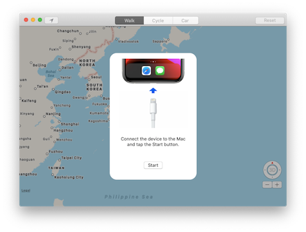
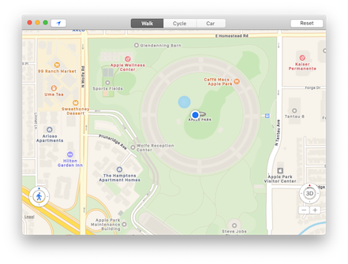

# Location Simulator

Location Simulator is a macOS app that allows you to spoofing the location of your iOS device. 
This app works as a GUI wrapper for the [idevicelocation](https://github.com/JonGabilondoAngulo/idevicelocation) library.

- [Features](#Features)
- [Getting Started](#getting-started)
    - [Requirements](#requirements)
    - [Build the app](#build-the-app)
- [Usage](#usage)
    - [Start spoofing](#start-spoofing)
    - [Move](#move)
    - [Stop spoofing](#stop-spoofing)
- [Author](#author)
- [License](#license)
- [Acknowledgments](#acknowledgments)

## Features

- [x] Spoofing the location without having to jailbreak or install a dedicated iOS app.
- [x] Instead of entering the latitude/longitude, select the coordinates from the map.
- [x] Supported 3 types of movenments speeds (Walk/Cycle/Car).

## Getting Started

### Requirements

- macOS 10.15+
- Xcode 11.5+
- Swift 5.0+

### Build the app

1. Install the latest version of [libimobiledevice](https://github.com/libimobiledevice/libimobiledevice) from source code.
2. Install the latest version of [idevicelocation](https://github.com/JonGabilondoAngulo/idevicelocation) from source code.
3. Download the source code from github and open it in Xcode.
4. Press the Run button to run the app.

## Usage

### Start spoofing

1. Connect the iOS device to the Mac and press the start button of the app.
2. Press and hold on the map, the coordinates will be set as the current location of the device.

### Move

- Tap on the walking button at the bottom left to move the coordinates.
   You can change the direction of movement by dragging the blue triangle around it.
   

- Press and hold the walking button to enter the automatic movement mode. 
   Press the button again to release it.
   

### Stop spoofing

Press the Reset button of the app.

## Author

Watanabe Toshinori – toshinori_watanabe@tiny.blue

## License

This project is licensed under the MIT License. See the [LICENSE](LICENSE) file for details.

## Acknowledgements

This application makes use of the following third party libraries. Thank you for a great library:

- [libimobiledevice](https://github.com/libimobiledevice/libimobiledevice) for talk protocols for iOS deivce.
- [idevicelocation](https://github.com/JonGabilondoAngulo/idevicelocation) for simulate a location on iOS device.
